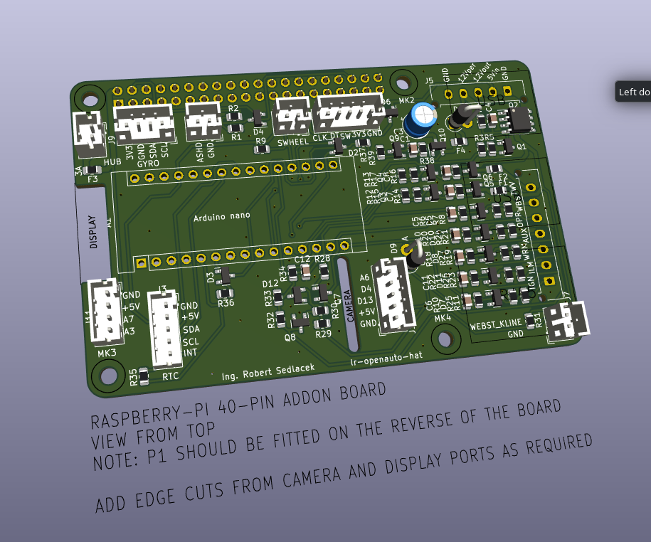

## li-hudiy-rpi-hat
RPi hat suitable for HUDIY. I used it in Land Rover Discovery II.

Functions:
 - self power control with latch-up
 - steering wheel resistance button read
 - power control of RPi
 - rotary encoder (volume)
 - light sensor (control backlight/da/night mode)
 - heater power on by timing with RTC (NOT IMPLEMENTED IN HUDIY YET)
 - webasto RX/TX interface (NOT TESTED YET)
 - connector for I2C gyroscope for inclinometer (NOT IMPLEMENTED IN HUDIY YET)

Python code is used for communicating between HUDIY and arduino.

Old project name was lr-openauto-hat, because first version was used with OpenAuto.

## License

This project is licensed under the [GNU GPLv3](https://www.gnu.org/licenses/gpl-3.0.html).

- ✅ The code can be freely used, distributed, and modified.  
- 🔄 All modifications must be released under the same license.  
- ⚠️ This license does **not** prohibit commercial use.

